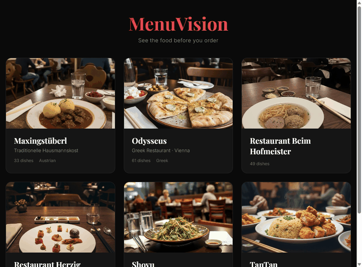

# MenuVision

Build beautiful HTML photo menus for any restaurant from URLs, PDFs, or photos. Works with menus in any language.

<p align="center">
  
</p>

<p align="center">
  <a href="https://ademczuk.github.io/menus/">Live Gallery</a> · <a href=".claude/skills/menu-builder.md">Skill File</a> · <a href="https://github.com/ademczuk/MenuVision/issues/new?template=submit-menu.yml">Submit a Menu</a>
</p>

## What is this?

MenuVision is an **OpenClaw / Claude Code skill** — a build specification that AI coding assistants use to create restaurant menus end-to-end. The skill file contains the full data contract, extraction prompts, and pipeline architecture so the AI agent can generate working code from scratch.

1. **Extract** menu data from a website URL, PDF, or photo → structured JSON (Gemini Vision)
2. **Generate** food photos using AI (Gemini Image)
3. **Build** an HTML menu with Instagram-style grid, tap-to-select, receipt view, and currency converter (CSS/JS inline, images as relative paths)

## How to Use

### Method 1: Claude Code (automatic — recommended)

```bash
git clone https://github.com/ademczuk/MenuVision.git
cd MenuVision
cp .env.example .env   # fill in your API keys
```

Open the project in Claude Code. The skill is auto-discovered from `.claude/skills/`. Just ask:

- "Build a menu for https://www.shoyu.at/menus"
- "Create a photo menu from this PDF" (attach file)
- "Make a digital menu from these photos"

### Method 2: Any AI coding assistant

Copy `.claude/skills/menu-builder.md` into your project and reference it in your prompt. The file contains everything the AI needs: JSON schema, extraction prompt, image prompt template, API config, and multilingual handling.

### Method 3: OpenClaw messaging bot (Telegram, WhatsApp, Discord, etc.)

Deploy the skill to your OpenClaw gateway container:

```bash
cp .claude/skills/menu-builder.md /path/to/openclaw/workspace/skills/menuvision/SKILL.md
```

The skill activates on triggers: "menu", "menuvision", "restaurant", "build menu", "photo menu". Works with any messaging platform supported by your OpenClaw gateway.

## What's in the Skill File

The core of this repo is [`.claude/skills/menu-builder.md`](.claude/skills/menu-builder.md) — a complete build specification containing:

- **JSON data contract** — the exact schema all pipeline stages share (breaks if deviated from)
- **Extraction prompt** — 12-rule Gemini prompt that defines schema + extraction behavior
- **Gemini API config** — model name, JSON mode, 64K token limit, truncation detection
- **Image prompt template** — `build_food_prompt()` for casual phone-photo aesthetic
- **Multilingual/CJK handling** — bilingual fields, Unicode detection, Latin-script prompt routing
- **File naming conventions** — `images/{stem}/{code}.jpg` pattern + case-insensitive fallback
- **HTML output spec** — responsive grid, selection system, allergen legend, branding
- **Cost breakdown** — per-image and per-menu pricing

## Output Modes

**Portable (default)** — Generates a single self-contained HTML file with base64-embedded images. Open it locally, email it, or upload to any host. No setup beyond a Gemini API key.

**GitHub Pages (optional)** — Set `GITHUB_OWNER`, `GITHUB_REPO`, and `GITHUB_PAT` to publish to your own GitHub Pages gallery. Each menu gets its own page with a shared gallery index.

## Environment Variables

| Variable | Required | Purpose |
|----------|----------|---------|
| `GOOGLE_API_KEY` | Yes | Menu extraction + image generation (Gemini) |
| `GITHUB_PAT` | For publishing | Authenticated push to your GitHub Pages repo |
| `GITHUB_OWNER` | For publishing | Your GitHub username |
| `GITHUB_REPO` | For publishing | Your GitHub Pages repo name (default: `menus`) |

## Cost

| Component | Cost |
|-----------|------|
| Per image (Gemini) | $0.039 |
| 80-item menu | ~$3.12 |
| Time (80 items) | ~8 min |

## Live Gallery

Browse generated menus at **[ademczuk.github.io/menus](https://ademczuk.github.io/menus/)**

Currently featuring: Shoyu (Japanese, 80 dishes), Odysseus (Greek, 61 dishes), TanTan (Chinese, 75 dishes), Maxingstuberl (Austrian, 33 dishes), and more.

## Contribute a Menu

Want to add your favorite restaurant? [Open an issue](https://github.com/ademczuk/MenuVision/issues/new?template=submit-menu.yml) with:
- Restaurant name and location
- Menu URL, PDF, or photo

A maintainer reviews submissions and runs the pipeline. No code required from your side — just provide the source material.

## Security & Privacy

- Community submissions require maintainer approval before processing (label-gated)
- Gemini extraction uses `response_mime_type: "application/json"` — structured output only, not arbitrary text
- HTML builder auto-escapes all content from JSON (prevents XSS from adversarial menu data)
- Only external API used is Google Gemini (for extraction and image generation)
- No telemetry, analytics, or tracking
- API keys are read from environment variables, never hardcoded
- All processing is local except Gemini API calls
- See the [skill file](.claude/skills/menu-builder.md#external-endpoints) for the full endpoint list

## License

MIT
